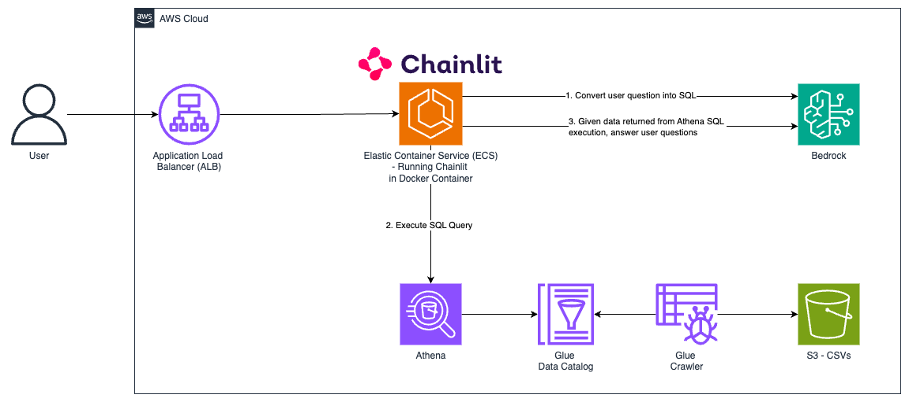

# Natural Language Query with GenAI

# Pre-requisites
- Ensure you have model access enabled for your chosen model in the deployment region (Claude Haiku by default). See here for more details: https://docs.aws.amazon.com/bedrock/latest/userguide/model-access-modify.html 

# AWS Deployment Instructions


1. Change to the cdk directory
```
cd cdk 
```

2. Extract the example-data.zip to a folder specifically named 'example-data'

There are 3 example csv's from Kaggle: [Video Game Sales Data](https://www.kaggle.com/datasets/gregorut/videogamesales), [Student's Performance in Exams](https://www.kaggle.com/datasets/spscientist/students-performance-in-exams) and [Titanic](https://www.kaggle.com/competitions/titanic/overview)
```
unzip example-data.zip
```


3. To manually create a virtualenv on MacOS and Linux:

```
python3 -m venv .venv
```

4. After the init process completes and the virtualenv is created, you can use the following
step to activate your virtualenv.

```
source .venv/bin/activate
```

If you are a Windows platform, you would activate the virtualenv like this:

```
% .venv\Scripts\activate.bat
```

5. Once the virtualenv is activated, you can install the required dependencies.

```
pip install -r requirements.txt
```

6. Bootstrap (Only required on first run)

```
cdk bootstrap
```

7. Deploy
```
cdk deploy
```

8. Run the Glue Crawler in the AWS Console


    Visit: https://console.aws.amazon.com/glue/home#/v2/data-catalog/crawlers

9. Access the chatbot at the Application Load Balancer (ALB) address in the cloudformation outputs or here: https://console.aws.amazon.com/ec2/home#LoadBalancers:

    Test out a question! I.e. 

    `who were the biggest game publishers in the decade 2000-2010? And give me the total sales`


# Adding your own data
1. Create a folder in the `example-data` folder with your chosen table name
```
mkdir cdk/example-data/<new-table-name>
```

2. Add your CSV within this new folder

3. Re-run CDK Deploy
```
cdk deploy
```

4. Re-run the crawler and your tables will be automatically created. Visit: https://console.aws.amazon.com/glue/home#/v2/data-catalog/crawlers


# Local Development

Retrieve the Athena Connection String and Bedrock Prompt ID from the Cloudformation Outputs.


You will also require AWS credentials with the requisite permission for Athena, Bedrock, S3 etc. See here for more info: https://docs.aws.amazon.com/cli/v1/userguide/cli-configure-envvars.html

```
export ATHENA_CONNECTION_STRING="<PASTE_ATHENA_CONNECTION_STRING_HERE>"

export BEDROCK_PROMPT_ID=ABC123456 

export AWS_DEFAULT_REGION=ap-southeast-2

chainlit run -w chainlit-app.py
```


# Architecture
